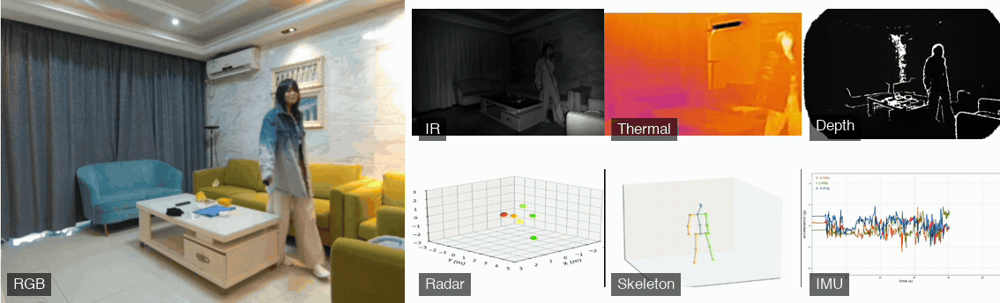

<p align="center">
  
</p>

<h1 align="center">A Large-Scale Multimodal Dataset and Benchmarks for Human Activity Scene Understanding and Reasoning</h1>

<p align="center">
  <a href="https://dl.acm.org/doi/epdf/10.1145/3745756.3809209"></a>
  <a href="https://openaiotlab.github.io/CUHK-X-Challenge/"></a>
  <a href="docs/assets/awards/20251104ACPBest_pre.pdf"></a>
</p>

<p align="center">
  <a href="https://dl.acm.org/doi/epdf/10.1145/3745756.3809209"></a>
  <a href="https://aiot-public-dataset-cuhk-x.cuhkaiot.com/"></a>
  <a href="https://openaiotlab.github.io/CUHK-X/"></a>
  <a href="https://openaiotlab.github.io/CUHK-X/explorer/"></a>
  <a href="https://github.com/openaiotlab/CUHK-X/releases"></a>
  <a href="LICENSE"></a>
</p>

<p align="center">
  
</p>
<p align="center"><sub>One recording, seven time-aligned streams: RGB · IR · Thermal · Depth · mmWave Radar · Skeleton · IMU</sub></p>

<p align="center">
  <a href="https://aiot-public-dataset-cuhk-x.cuhkaiot.com/"><b>📥 Get the data</b></a> &nbsp;·&nbsp;
  <a href="https://openaiotlab.github.io/CUHK-X/explorer/"><b>🛰️ Explore it in your browser</b></a> &nbsp;·&nbsp;
  <a href="https://openaiotlab.github.io/CUHK-X-Challenge/"><b>🏆 Join the $20K Kaggle challenge</b></a>
</p>

> **CUHK-X** is a comprehensive multimodal dataset containing **64,267 samples** across **seven modalities** designed for human activity recognition, understanding, and reasoning. It addresses critical gaps in existing HAR datasets by providing synchronized multimodal sensor data with detailed annotations for complex reasoning tasks.

## 🧭 What's in this repo

| Path | What it is |
|------|------------|
| [`SM/`](SM/) | Small-model HAR baselines for RGB, IMU, mmWave radar and skeleton (PyTorch training and evaluation pipelines). |
| [`LM/`](LM/) | CUHK-X-VLM: large-model benchmark code for HAU and HARn tasks (action selection, captioning, emotion analysis, sequential reordering, next-action prediction) with QwenVL, InternVL, Video-LLaVA and Video-Chat. |
| [`docs/`](docs/) | Project website and the in-browser [Observatory](https://openaiotlab.github.io/CUHK-X/explorer/) with curated depth / IR / thermal clips. |
| [`scripts/`](scripts/) | Asset build scripts for the Observatory and the README banner. |

Dataset files are distributed separately under a Data Use Agreement. Request access on the [dataset portal](https://aiot-public-dataset-cuhk-x.cuhkaiot.com/).

## 🎉 News

- **[Sep 2026]** 📦 **[v1.0.0](https://github.com/openaiotlab/CUHK-X/releases/tag/v1.0.0) is out** — first tagged release of the baseline code (SM + LM), project website and Observatory. GitHub now shows a "Cite this repository" button via `CITATION.cff`.
- **[Jun 2026]** 🏆 **The [CUHK-X Challenge](https://openaiotlab.github.io/CUHK-X-Challenge/) is live on Kaggle!** USD \$20K prize pool across two tracks (Small Model · Large Model), built on CUHK-X — finals at UbiComp 2026, Shanghai. Pre-register your team.
- **[Jun 2026]** 🛰️ **The [CUHK-X Observatory](https://openaiotlab.github.io/CUHK-X/explorer/) is live!** Stream real CUHK-S clips in the browser: synchronized depth ⊕ infrared ⊕ thermal playback, a 40-action atlas organized by the paper's seven categories, and a playable next-action reasoning quiz with real ground truth.
- **[Jun 2026]** **The [project website](https://openaiotlab.github.io/CUHK-X/) got a full redesign** — now organized into Home, [Dataset](https://openaiotlab.github.io/CUHK-X/dataset.html), [Benchmarks & Results](https://openaiotlab.github.io/CUHK-X/benchmarks.html) and [Publications](https://openaiotlab.github.io/CUHK-X/publications.html) pages.
- **[Feb 2026]** **CUHK-X is accepted by MobiSys 2026!** 
- **[Nov 2025]** 🏆 **CUHK-X wins the Best Presentation Award at ANAI Workshop @ MobiCom 2025!** 
<!-- We are honored to receive this recognition for our work on multimodal human action recognition, understanding, and reasoning. -->

## 🎯 Key Contributions

- **First Multimodal HAU Dataset**: CUHK-X is the first dataset to integrate understanding and reasoning across multiple modalities for human action analysis
- **Large-Scale & Diverse**: 64,267 samples from 30 participants across diverse environments with 7 synchronized modalities
- **Novel Evaluation Framework**: Three comprehensive benchmarks (HAR, HAU, HARn) with 6 distinct tasks
- **LLM-Empowered Annotation**: Innovative prompt-based scene creation framework for logical and spatio-temporal representation

## 📊 Dataset Overview

### Modalities (7 Total)
- **RGB Video**: Standard color video recordings
- **Infrared (IR)**: Thermal imaging for robustness to lighting conditions  
- **Depth**: 3D spatial information from depth cameras
- **Thermal**: Heat signature analysis
- **IMU**: Inertial Measurement Unit sensor data
- **mmWave Radar**: Privacy-preserving motion detection
- **Skeleton**: 3D pose estimation data

### Statistics
- **Total Samples**: 64,267 annotated action samples
- **Participants**: 30 diverse subjects
- **Environments**: 2 indoor environments with varying conditions
- **Actions**: 40+ different action categories
- **Data Types**: Both singular actions and sequential activity sequences

## 🏗️ Dataset Structure

The dataset is organized into two main components:

### Small Model Data
- **Focus**: Singular, well-defined actions (similar to traditional datasets)
- **Actions**: 40+ different action categories
- **Samples**: 30,000+ individual action instances (a subset of the 64,267 total samples; the remainder belongs to the sequential Large Model Data)
- **Purpose**: Traditional HAR evaluation and baseline comparison

### Large Model Data  
- **Focus**: Sequential actions performed consecutively
- **Purpose**: Temporal and emotional analysis, complex reasoning tasks
- **Features**: Multi-step activity sequences with logical flow
- **Applications**: Human Action Understanding (HAU) and Next Action Reasoning (HARn)

## 🎯 Benchmarks & Tasks

### 1. Human Action Recognition (HAR)
**Objective**: Traditional action classification across modalities
- **Cross-trial evaluation** split data with 80% training 20% testing
- **Cross-subject evaluation** with Leave-One-Subject-Out (LOSO) protocol
- **Cross-domain performance** analysis different environment data distribution and training results
- **Long-tail distribution** handling 
- **Multimodal fusion** strategies

### 2. Human Action Understanding (HAU)  
**Objective**: Comprehend actions through perceptual and contextual integration

**Sub-tasks**:
1. **Action Captioning**: Generate natural language descriptions
2. **Emotion Analysis**: Identify emotional states during activities  
3. **Sequential Action Reordering**: Organize actions chronologically
4. **Action Selection**: Choose relevant actions from candidates

### 3. Human Action Reasoning (HARn)
**Objective**: Infer intentions and causal relationships in action sequences
- **Next Action Prediction**: Predict likely subsequent actions
- **Temporal Reasoning**: Understand action progression logic
- **Contextual Inference**: Consider environmental and situational factors

## 🔬 Technical Highlights

### Novel Framework
- **LLM-Generated Scenarios**: Consistent and logical activity descriptions
- **Human-in-the-Loop Validation**: Quality assurance for generated content
- **Synchronized Collection**: All modalities captured simultaneously
- **Environmental Diversity**: Multiple settings and conditions

### Hardware Setup
- **Vzense NYX 650**: RGB-D camera for color and depth
- **Texas Instruments Radar**: mmWave sensing for privacy-preserving detection
- **IMU Sensors**: Motion and orientation tracking
- **Thermal Cameras**: Heat signature analysis
- **Synchronized Recording**: Temporal alignment across all modalities

## 📈 Key Findings

### Model Performance Insights
- **Larger models** (7B parameters) consistently outperform smaller ones across tasks
- **QwenVL-7B** and **VLLaVA-7B** demonstrate superior performance in most benchmarks
- **Depth and IR modalities** often provide richer information than RGB for reasoning tasks
- **Cross-subject performance** drops significantly (56.56% vs higher in-domain accuracy)

### Challenging Aspects
- **Domain Shift**: Cross-domain evaluation reveals substantial performance gaps
- **Long-tail Distribution**: Realistic but challenging class imbalance
- **Sequential Reasoning**: Complex temporal understanding requires advanced models
- **Multimodal Fusion**: Optimal combination strategies vary by task

## 📋 Benchmark Results

### HAR Overall Cross-trial Performance
| Modality | Accuracy | F1 score | Precision | Recall |
|----------|----------|----------|------------|------------|
| RGB      | 90.89%   | 91.28%   | 92.24%     | 91.02%     |
| Depth    | 90.46%   | 90.93%   | 91.76%     | 90.75%     |
| IR       | 90.22%   | 90.46%   | 91.53%     | 89.94%     |
| Thermal  | 92.57%   | 93.36%   | 93.54%     | 93.50%     |
| Radar    | 46.63%   | 44.53%   | 48.29%     | 46.63%     |
| IMU      | 45.52%   | 38.32%   | 40.84%     | 38.00%     |
| Skeleton | 79.08%   | 84.17%   | 91.46%     | 79.08%     |

### HAU Performance (Selected Tasks)
| Model       | Captioning(BLEU-1) | Emotion Analysis(Accuracy) | Sequential Reordering(Accuracy) |
|-------------|--------------------|----------------------------|---------------------------------|
| QwenVL-7B   | 18.04%             | 55.03%                     | 60.00%                          |
| VLLaVA-7B   | 12.86%             | 73.34%                     | 5.29%                           |
| InternVL-8B | 0.72%              | 31.35%                     | 74.03%                          |

## 🎯 Applications

### Healthcare & Monitoring
- **Cognitive Decline Detection**: Identify forgetfulness or repetitive behaviors
- **Daily Activity Assessment**: Monitor activities of daily living (ADL)
- **Rehabilitation Progress**: Track recovery through activity analysis

### Smart Environments  
- **Home Automation**: Context-aware system responses
- **Security & Safety**: Anomaly detection in activity patterns
- **Human-Computer Interaction**: Natural interface design

### Research & Education
- **Multimodal Learning**: Sensor fusion algorithm development
- **Temporal Reasoning**: Sequential action understanding
- **Privacy-Preserving AI**: Non-visual sensing research

## 🏆 Broader Impact

CUHK-X aims to advance research in:
- **Conventional HAR**: Multimodal algorithms and cross-domain methods
- **LLM Evaluation**: Benchmark for action understanding capabilities  
- **Educational Resource**: Standard dataset for teaching sensor fusion and multimodal reasoning
- **Real-world Deployment**: Bridge the gap between lab and practical applications

## 📝 Citation

If you use CUHK-X in your research, please cite our paper:

```bibtex
@inproceedings{10.1145/3745756.3809209,
  author    = {Jiang, Siyang and Yuan, Mu and Ji, Xiang and Yang, Bufang and Liu, Zeyu and Xu, Lilin and Li, Yang and He, Yuting and Dong, Liran and Lu, Wenrui and Yan, Zhenyu and Jiang, Xiaofan and Gao, Wei and Chen, Hongkai and Xing, Guoliang},
  title     = {A Large-Scale Multimodal Dataset and Benchmarks for Human Activity Scene Understanding and Reasoning},
  booktitle = {Proceedings of the 24th Annual International Conference on Mobile Systems, Applications and Services},
  series    = {MobiSys '26},
  year      = {2026},
  pages     = {352--370},
  numpages  = {19},
  publisher = {Association for Computing Machinery},
  address   = {New York, NY, USA},
  location  = {University of Cambridge, Cambridge, United Kingdom},
  isbn      = {9798400720277},
  doi       = {10.1145/3745756.3809209},
  url       = {https://dl.acm.org/doi/epdf/10.1145/3745756.3809209},
  keywords  = {human action understanding, large language models, datasets}
}
```

A machine-readable version lives in [`CITATION.cff`](CITATION.cff); GitHub's "Cite this repository" button uses it.

## 👥 Contact

For dataset access, questions, or collaborations:
- **Email**: syjiang [AT] ie.cuhk.edu.hk
- **Project Page**: [CUHK-X](https://openaiotlab.github.io/CUHK-X/)


## 📄 License

Code is released under the MIT License. The dataset is available for non-commercial research under a Data Use Agreement (DUA) and is not redistributable. Our derived annotations/splits are released under CC BY 4.0.

---

**Note**: This dataset is designed for research and educational purposes. Please ensure compliance with your institution's ethics guidelines when using human activity data.

We obtained approval from an Institutional Review Board (IRB) to conduct this study and collect data from human subjects.
